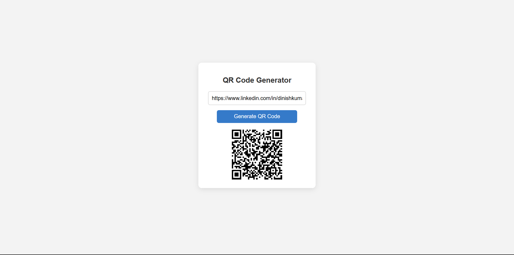

# QR Code Generator

A simple and responsive **QR Code Generator** built using **HTML, CSS, and JavaScript**.  
The application allows users to generate QR codes instantly from text or URLs using a lightweight external library.


## 📌 Overview

This project provides a clean user interface where users can enter any text or URL and generate a corresponding QR code dynamically on the page.


## 🛠️ Tech Stack

- HTML5  
- CSS3  
- JavaScript (Vanilla JS)  
- QRCode.js Library  


## 📂 Folder Structure

qr-code-generator-js/
│
├── index.html
├── style.css
└── script.js


## ✨ Features

- Generate QR codes from text or URLs
- Instant QR code rendering
- Clean and minimal UI
- Responsive centered layout
- No page reload required


## 🚀 Getting Started

1. Clone the repository  
   ```bash
   git clone https://github.com/dinishsg/qr-code-generator-js.git
2. Open index.html in any web browser.


## 📸 Screenshots




## 🌐 Live Demo

🔗(https://dinishsg.github.io/qr-code-generator-js/)
   
